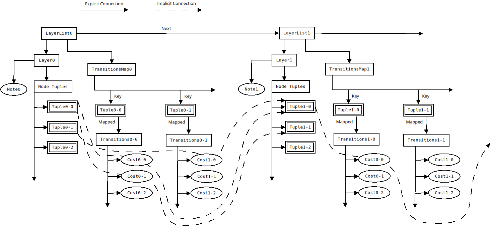

# Music Fingering Position Generator

A personal project with the goal of creating software to automically construct a 
fingering position sequence for a given	music score (for a single bowed string 
instrument currently). By using user defined preferences and instrument definitions 
the 
software should be able to give a good base of fingering positions when fed a sheet 
music MusicXML file. Uses the mx library (found at https://github.com/webern/mx) for 
MusicXML parsing. Also uses the cxxopts library for parsing inputs and managing
options (https://github.com/jarro2783/cxxopts). gtest is used for unit and integration
tests.

# Program Explanation

The program works by constructing a weighted DAG and running a shortest path 
algorithm on it.

## Graphical Representation

Below is an image of how the graph is represented in the program.

The tuples in the layers represent the nodes in the graph and the costs in the 
transition map represent the weights on the edges. The edges are defined as going
between the tuple that is the key in the transition map and the tuple in the *n'th* 
position in the layer of the next LayerList, where *n* is the index of the vector
in the mapped value. A future improvement would be to replace the maps with 
matrices and instead of defining the first node of the edges via the key the edge
is instead defined as a column/row pairing in the matrix.

## Program Structure

The program takes a musicXML score as input which is parsed by the mx library. The 
structure created by the mx library is then converted to a notelist of simplified 
notes. An instrument is then constructed by defining strings and actions, a notemapper 
is also built which is used to define all possible physical representations for all 
possible notes. The notelist is then combined with the instrument to generate a linked 
list of layers, where each layer represents one note in the notelist and contains all
physical ways to play that note. The actions are then used in combination with the
layerlist to calculate the cost of each transition between the physical representations
in subsequent layers. Once the costs have been calculated a shortest path solver is 
used to find the shortest path through the graph, which results in the *best* way
to play the score according to the action setup.

## User Inputs

The user will eventually supply up to 4 files as input.

### Music Score

Currently only musicXML is supported but conversion should not be a problem to 
implement to allow other formats.

### Note Mapper

As musical notes are too abstract to be used directly for any useful cost calculations
for transitions a note mapper is required to map the abstract notes to physical 
representations of those notes. Since there are many different physical metrics which
could be used to represent notes the note mapper will be definable by the user, but 
basic note mappers will be supplied if the user has no need for anything specific.
User defined note mappers could be part of the future DSL.

### Strings

In order to define the physical characteristics of notes there will also need to be
a definition of the strings on the instrument and what notes can be played on those
strings. This could be done by the user as part of the DSL or come pre-defined
as part of the program.

### Action Set

To calculate transitions between physical representations of notes an action set must
be defined. This set will consist of smaller constraints and the cost of the transition
if those 
constraints are fullfilled, if the first note is played on string 1, and the second
note is played on string 2 the cost could increase by 1, for example. The actions
are to be defined in order of when they are checked, they can also be defined as 
either occurring by default or only occurring if some other specific action has
occurred. This means actions can also have dependencies defined between eachother, 
with some actions disabling later actions if they do occur. Actions are the main 
reason for defining a future DSL.

