# GUI Guide

This is a short guide on what the different components in the GUI do.

## Overview

Here is a full view of the MFPG Gui.

	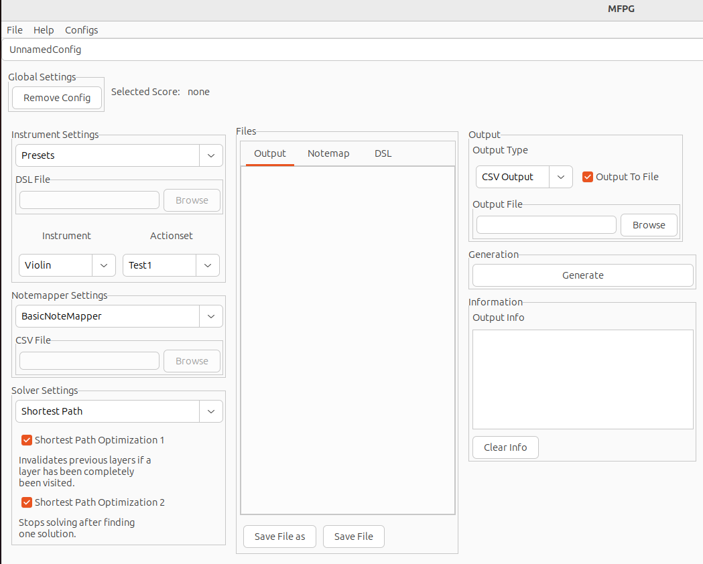

## Top Menu

	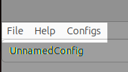

The top menu has 3 submenus:

- File	

	The file menu is used for selecting the target score. Currently this can only
	be done by locally storing the score and importing it directly to the program.
- Help

	The help menu provides direction to helpful resources such as guides and tutorials.
- Configs

	The configs menu allows for saving, loading, deleting, and creating new configs. The program uses a hidden file called **.mfpg_configs.xml** to store
	configs in XML format. If no such file is found these options will be
	disabled.

## Config Selector

	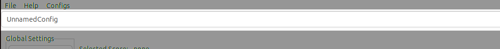

The config selector selects between currently imported configurations. This is not the
same as the _configs_ submenu in the previous section, as it does not save nor load 
configs from a file but instead temporarily stores configs until program exit. 

## Global Settings

	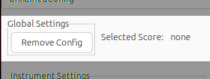

This section is for selections which do not depend on configurations. The _Remove 
Config_ button deletes the temporary current config, but does not delete it from the
permanent storage in the config storage file. The selected score label shows which
score is currently selected.

## Instrument Settings

	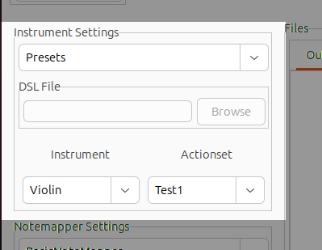

Here we determine the instrument specifications. This can be done by using _presets_ 
or by loading the instrument and actionset from a DSL (domain specific language) file. 
The presets are hardcoded values and currently there are not many presets available. 
Therefore it is recommended to use the DSL (for information on how to do this, see the
DSL guide.) for most purposes currently. This is done by importing a **.mfpg** DSL
file into the program using the DSL file selector. 

Only the violin is available as an 
instrument preset so far, while the actionset presets are simple actionsets 
primarily used for testing. The implementation of these actionsets can be found in
the GitHub repo in the **src/configs.h** file.

## Notemapper Settings

	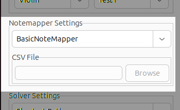

The notemapper selection is limited to the hardcoded basic notemapper, which has the 
three basic attributes mapped (Finger, String, and Hand Position) for a standard
violin. The CSV Notemapper option requires importing a CSV file. This CSV file can 
either be a premade one (the GitHub repo has a standard CSV notemap file which 
contains a few different attributes.), or constructed using the CSV file constructor,
although the second option requires some work as well as some programming (see the
CSV Builder guide for more information regarding this approach).

## Solver Settings

	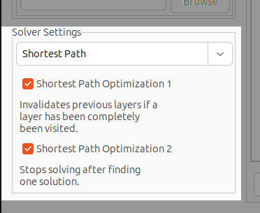

The solver section is more focused on output accuracy and efficiency. The Shortest
Path solver gives an accurate output based on the entire score. The greedy solver 
selects the easiest path based on the easiest next step. This means that the shortest
path solver is the solver that should be used unless there is a specific reason to
use the greedy solver. 

The checkboxes are efficiency optimizations to the shortest
path solver allow for faster solutions. This will in general not be a problem since 
the solver will often times be fast enough without these optimizations, but for some
extreme cases they might improve performance noticably. In the future, multiple 
fingerings might be generated to give the user a set of fingerings to choose from 
rather than the current method of selecting the 'optimal' solution only. When this
is implemented these optimizations might need to be disabled to allow for multiple
solutions.

## Files Area

	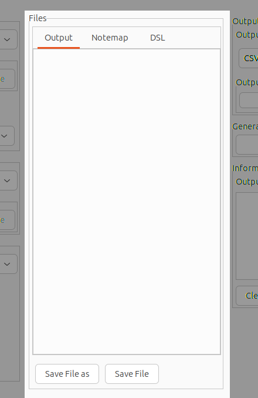

The middle section of the GUI is for selected DSL and CSV Notemapper file, as well 
as the output. These are accessed via the tabs at the top. Once a file is
selected via the file selectors in other sections they can be modified and 
saved in the file window. The program operates on the saved files, so making changes 
to the DSL file in the file window does not change the output of the program unless 
the file is saved first. The file windows are as follows:

- Output

    This is where the output file is shown, if no output file is selected the results
    are shown here anyway, but are not saved to any file.
- Notemapper

    Here the selected CSV Notemapper file is shown if the CSV Notemapper is used.
- DSL

    Here the selected DSL file is shown, and where it can be modified directly. In
    future versions there will be built-in highlighting and typechecking available 
    here.

## Output Area

	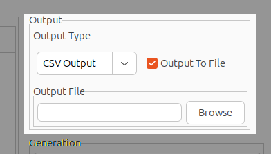

The Output section allows configuring output. The output can either be in CSV format,
where the output will be split into columns for each attribute in the actionset (as 
well as a few other columns), or in a basic format where the output is more verbose.
The output can also be directed to a file if desired.

## Generation Area

	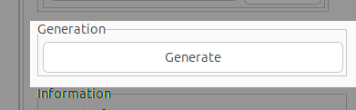

The 'Generate' button runs the program with the current settings.

## Information Area

	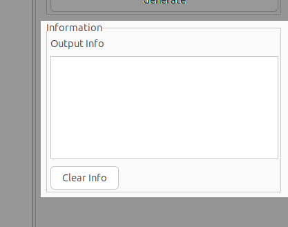

The information area shows output information that is related to program execution
rather than the generated fingering position output. This could be things like 
program errors or logging information. The clear info clears the output info area.
